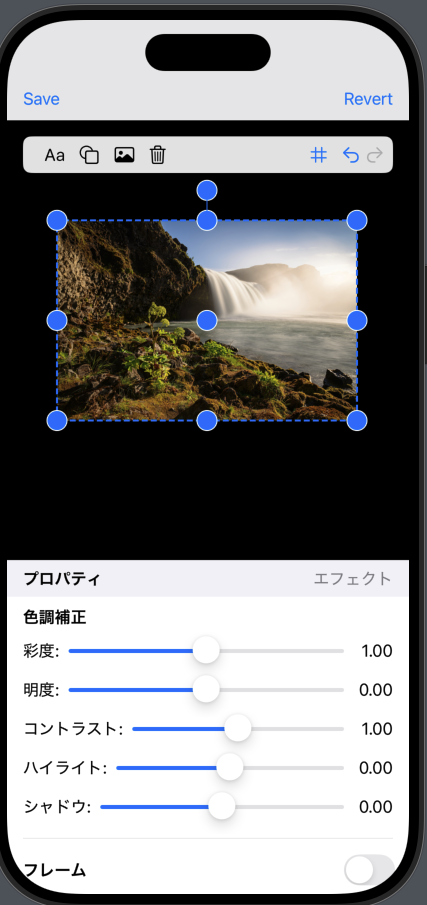
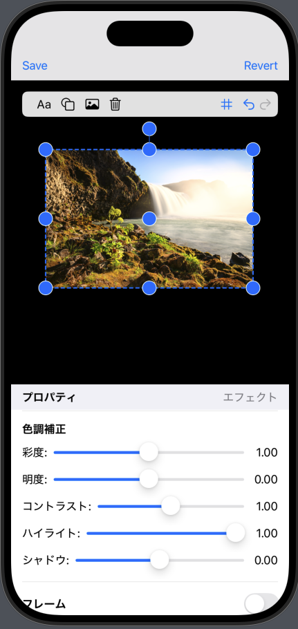
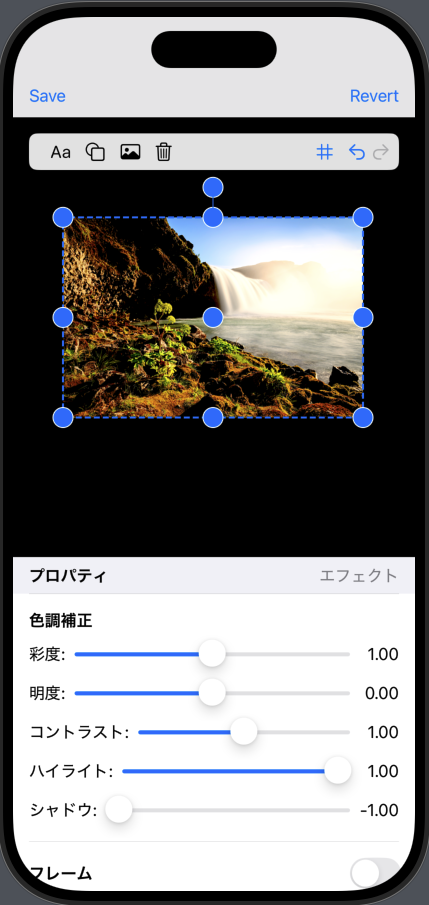

# 概要
GLogoは画像編集用のiOSアプリケーションです。

## 技術情報 -アーキテクチャ
- **Models**: ロゴプロジェクト、要素（テキスト、図形、画像）、背景設定などのデータモデル
- **ViewModels**: エディタ、要素編集、エクスポートなどの操作ロジック
- **Views**: SwiftUIベースのユーザーインターフェース

### 言語: Swift 6.0
- UI Framework: SwiftUI + UIKit
- グラフィックス: Core Graphics, Core Image
- イベント処理: イベントソーシングパターンによるUndoとRedo
- 非同期処理: Swift Concurrency (async/await)

# フィルターの詳細
- ルミナンスマスクベースのセレクティブ調整: 標準のCore Imageフィルターでは実現できないハイライトとシャドウの実装。RGB→輝度変換にITU-R BT.709規格の係数（R: 0.2126, G: 0.7152, B: 0.0722）を採用し、人間の視覚特性に基づいた自然な調整を実現。
- マルチパスフィルタリング: 複数のフィルターを段階的に適用することで複雑な効果を実現。例えば、ハイライト調整では輝度抽出→ガンマ補正→露出調整→マスクブレンドの4段階の処理を実装。
- 合成処理の最適化: **CIBlendWithMask**

# ハイライト&シャドウの実装詳細
Core Imageには直接これらを操作するための標準フィルターが存在しない為、複数のフィルターを組み合わせて独自に実装。
**ハイライト調整は画像の明るい部分のみを選択的に調整するための機能です。**

## 1.前処理と入力値の検証

- 調整量が0の場合は処理をスキップして元画像を返す（最適化）
- 調整量を-1.0〜1.0の範囲に制限して予測可能な動作を確保


## 2.ルミナンスマスクの作成

- CIColorMatrixフィルターを使用して画像をグレースケールに変換
- RGB→輝度変換にITU-R BT.709規格の係数(R:0.2126, G:0.7152, B:0.0722)を使用
- この係数は人間の視覚特性（緑に最も敏感）に基づいている


## 3.暗くする場合と明るくする場合で処理を分岐
a. ハイライトを暗くする場合:

- ガンマ補正（CIGammaAdjust）を適用し明るい部分を強調したマスクを作成
- CIExposureAdjustで露出を下げる（負のEV値を設定）
- CIBlendWithMaskでマスクを使って元画像と調整画像をブレンド

b. ハイライトを明るくする場合:

- 同様にガンマ補正でマスクを作成
- CIExposureAdjustで露出を上げる（正のEV値を設定）
- CIBlendWithMaskでマスクを使って元画像と調整画像をブレンド


## 4.マスクによる部分的な適用

- マスクの明るさに応じて元画像と調整画像を合成
- これにより画像の明るい部分のみが調整され、暗い部分は元のまま保持される


# シャドウ調整の実装
**シャドウ調整は画像の暗い部分だけを部分的に調整するための機能です。**

## 前処理と入力値の検証

- 調整量が0の場合は処理をスキップ
- 調整量を-1.0〜1.0の範囲に制限


## 暗くする場合と明るくする場合で処理を分岐
a. シャドウを暗くする場合:

- CIColorControlsでコントラストを増加させ、明るさを微減
- CIColorMatrixで輝度マスクを生成（暗い部分を検出）
- CIGammaAdjustでガンマ値を大きくし暗い部分を強調したマスクを作成
- CIBlendWithMaskでマスクを使って元画像と調整画像をブレンド

b. シャドウを明るくする場合:

- CIColorControlsで明るさを増加
- CIColorMatrixで輝度マスクを生成
- CIColorInvertでマスクを反転し、暗い部分を強調
- CIGammaAdjustでさらに中間〜暗い部分を強調
- CIBlendWithMaskでマスクを使って元画像と調整画像をブレンド

**編集前**


**ハイライト編集後**


**ハイライト&シャドウ編集後**



#　画像クロップ処理の修正（iOS向き対応）
## 問題の概要
縦長画像のクロップ処理が正しく動作しない不具合が発生しました。特定サイズ（4284×5712、1178×1572等）の縦長画像でのみ、クロップ結果の幅と高さが入れ替わってしまうという症状が見られました。

## 原因分析
iOS画像処理の構造的な問題
iOSにおける画像処理には、以下の2つの重要な概念があります：
- 1 UIImage: 表示時の向き情報（orientation）を含む画像オブジェクト
- 2 CGImage: 実際のピクセル配列のみを持つ低レベルな画像オブジェクト
例：縦長画像の場合
UIImage.size = (幅: 1178, 高さ: 1572)  ← 表示時のサイズ
CGImage.size = (幅: 1572, 高さ: 1178)  ← 物理的なピクセル配列

## 具体的な不具合のメカニズム
1 クロップ処理ではUIImage.sizeを基準に座標計算を実行
2 実際のクロップはCGImageに対して実行
3 向き情報が反映されていないため、サイズが逆転した状態でクロップが発生

### 向きを考慮したCGImageの生成

```swift
private func createOrientedCGImage(from uiImage: UIImage) -> CGImage? {
    let size = uiImage.size
    let format = UIGraphicsImageRendererFormat()
    format.scale = uiImage.scale
    format.opaque = false
    
    let renderer = UIGraphicsImageRenderer(size: size, format: format)
    
    let renderedImage = renderer.image { context in
        uiImage.draw(in: CGRect(origin: .zero, size: size))
    }
    
    return renderedImage.cgImage
}
```

### クロップ処理

```swift
private func cropImage() -> UIImage? {
    // 座標とかの計算処理など、、
    
    // 向きを考慮したCGImageを作成
    guard let orientedCGImage = createOrientedCGImage(from: originalImage) else {
        return nil
    }
    
    // このCGImageはUIImage.sizeと一致するサイズを持つ
    guard let croppedCGImage = orientedCGImage.cropping(to: scaledCropRect) else {
        return nil
    }
    
    return UIImage(cgImage: croppedCGImage)
}
```
## 重要なポイント
- UIGraphicsRendererの使用: 向き情報を自動的に考慮して描画
- 座標計算の一貫性: 常にUIImage.sizeを基準に計算

https://developer.apple.com/documentation/uikit/uiimage/orientation
https://developer.apple.com/library/archive/documentation/GraphicsImaging/Conceptual/drawingwithquartz2d/Introduction/Introduction.html
